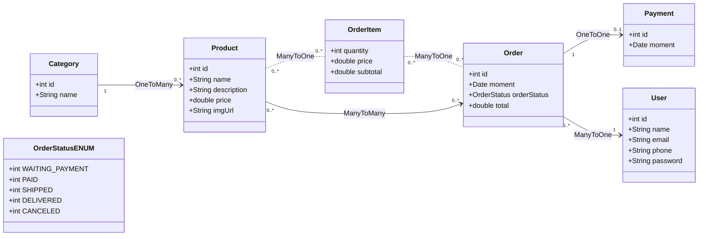

# Ecommerce 

## Índice
1. [Introdução](#introdução)
2. [Tecnologias Utilizadas](#tecnologias-utilizadas)
3. [Funcionalidades](#funcionalidades)
4. [Modelagem de Dados](#modelagem-de-dados)
5. [Executando o Projeto](#executando-o-projeto)
   - [Passos](#passos)
   - [Banco de Dados](#banco-de-dados)
6. [Documentação e Testes da API](#documentação-e-testes-da-api)

## Introdução
API RESTful projetada para um ecommerce, utilizando boas práticas do framework, e utilizando o padrão MVC para uma organização eficiente e estruturada das informações.

## Tecnologias Utilizadas
- Java 21
- Spring Boot 3.4.2
- Maven
- JPA repository 
- Hibernate
- Banco de Dados: H2 (Profile Test), Postgres (Profile Dev)
- Swagger (OpenAPI)
- Postman (Testes unitários)
- Eclipse (Ambiente de Desenvolvimento) 

## Funcionalidades
Funcionalidades da API:

### Users
- `POST /users`: Cadastra um novo usuário.
- `GET /users/{id}`: Retorna os dados de um usuário por ID.
- `GET /users`: Lista todos os usuários.
- `PUT /users/{id}`: Atualiza os dados de um usuário.
- `DELETE /users/{id}`: Deleta um usuário pelo ID.

### Product
- `POST /products`: Cadastra um novo produto.
- `GET /products/{id}`: Retorna os dados de um produto por ID.
- `GET /products`: Lista todos os produtos.
- `PUT /products/{id}`: Atualiza os dados de um produto.
- `DELETE /products/{id}`: Deleta um produto pelo ID.

### Order
- `POST /orders`: Cadastra um novo pedido.
- `GET /order/{id}`: Retorna os dados de um usuário por ID.
- `GET /orders`: Lista todos os pedidos.
- `PUT /orders/{id}`: Atualiza os dados de um pedido.
- `DELETE /orders/{id}`: Deleta um pedido pelo ID.

### Category
- `POST /categories`: Cadastra uma nova categoria.
- `GET /categories/{id}`: Retorna os dados de uma categoria por ID.
- `GET /categories`: Lista todas as categorias.
- `PUT /categories/{id}`: Atualiza os dados de uma categoria.
- `DELETE /categories/{id}`: Deleta uma categoria pelo ID.

## Modelagem de Dados



## Executando o projeto

### Passos
1. Clone o repositório:
   ```bash
   git clone https://github.com/yuricn0/api-pessoas-contatos.git 

2. Abra na IDE de sua prefêrencia ou no próprio terminal.
- **[Eclipse](https://eclipseide.org/)**
- **[IntelliJ IDEA](https://www.jetbrains.com/idea/download/?section=windows)**
- **[Spring Tool Suite (STS)](https://spring.io/tools)**

3. Compile a aplicação

   ```bash
   mvn clean install
   
4. Execute a aplicação

   ```bash
   mvn spring-boot:run
   
Isso iniciará a aplicação Spring Boot. Se tudo estiver configurado corretamente, você poderá acessar a API no endereço http://localhost:8080

## Banco de Dados

Vá até o pacote src/main/resources e entre no arquivo `application.properties` e verá `spring.profiles.active=dev` troque para `spring.profiles.active=test` caso não queira instalar o banco Postgres localmente, após essa troca pro perfil de teste, passa-se agora utilizar o banco h2 (em memória). Ainda no mesmo pacote, no arquivo `application-test.properties` haverá a configuração do banco, se atente as credenciais de acesso ao banco.

- spring.datasource.username=(username aqui)
- spring.datasource.password=(senha aqui)

O banco de dados pode ser acessado pelo endereço: http://localhost:8080/h2-console 

## Documentação e Testes da API 

A documentação da API está disponível através do Swagger, uma ferramenta que permite explorar e testar os endpoints da API.
Após iniciar o projeto, você pode acessar a documentação da API no seguinte endereço: http://localhost:8080/swagger-ui/index.html 

